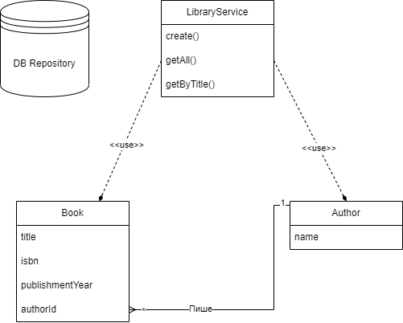

# Лабораторна робота 1

## Завдання

Розробіть програму мовою Java для керування простою бібліотекою.
У бібліотеці є книги, і кожна книга має такі властивості:

1. Назва
2. Автор
3. Номер ISBN
4. Рік видання

## Функціональність програми

1. Додавати нову книгу в бібліотеку.
2. Показувати всі книги в бібліотеці.
3. Шукайти книгу за її назвою.

## План розробки

### Структура проекту

На цій діаграмі можна детально ознайомитися з структурою проекту, яка детально описана нижче



### Розробка моделей:

- Створення моделей даних для книг та авторів, які відповідають структурі бази даних.
- Реалізація інтерфейсу IIdetifiable та абстрактного класу Model.

```java

public interface IIdetifiable {
    long getId();

    void setId(long id);
}

```

```java
@Data
public abstract class Model implements IIdetifiable {
    private long id;

    public long getId() {
        return id;
    }

    public void setId(long id) {
        this.id = id;
    }

}
```

### Розробка репозиторіїв:

- Створення репозиторіїв для доступу до даних (у нашому випадку і збереження даних).
- Реалізація методів для додавання, оновлення, видалення та отримання об'єктів з бази даних.
- Репозиторій автоматично втсановлює `Autoincrement Id` за допомогою `IdGenerator`

```java
public class DBRepository<T extends IIdetifiable> {

    private Map<Long, T> storage = new HashMap<>();
    private final IdGenerator idGenerator = new IdGenerator();

    public void add(T item) {
        item.setId(idGenerator.getId());
        storage.put(item.getId(), item);
    }

    public void delete(long id) {
        if (storage.containsKey(id)) {
            storage.remove(id);
        }
    }

    public T findById(long id) {
        return storage.get(id);
    }

    public List<T> findManyBy(Predicate<T> filter) {
        List<T> result = new ArrayList<>();
        for (T item : storage.values()) {
            if (filter.test(item)) {
                result.add(item);
            }
        }
        return result;
    }

    public List<T> getAll() {
        return storage.values().stream().toList();
    }

}
```

```java
public class IdGenerator {
    private Long id = 0L;

    public long getId() {

        return ++id;
    }
}
```

### Розробка сервісів:

- Створення сервісів для обробки бізнес-логіки.
- Реалізація методів для створення нових книг, отримання списку всіх книг та пошуку книг за назвою.

```java
public class LibraryService {
    private final DBRepository<Book> bookRepository;

    public LibraryService(DBRepository<Book> bookRepository) {
        this.bookRepository = bookRepository;
    }

    public void create(Book book) {
        bookRepository.add(book);
    }

    public List<Book> getAll() {
        return bookRepository.getAll();
    }

    public List<Book> getByTitle(String title) {
        return bookRepository.findManyBy((book) -> book.getTitle().equalsIgnoreCase(title));
    }
}

```
